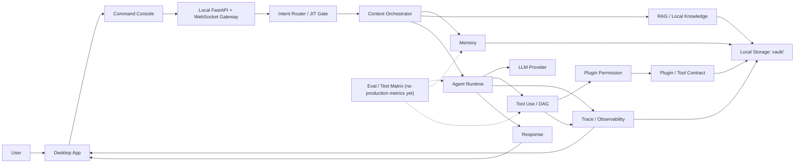
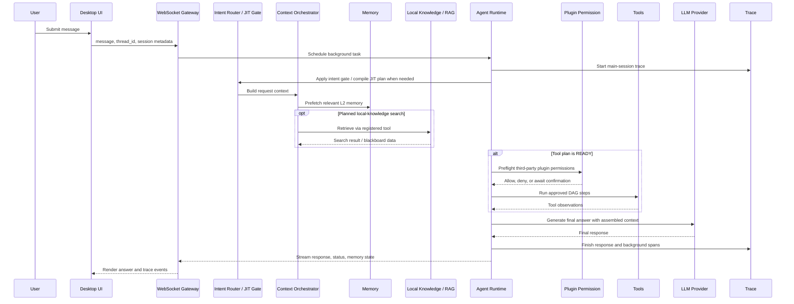
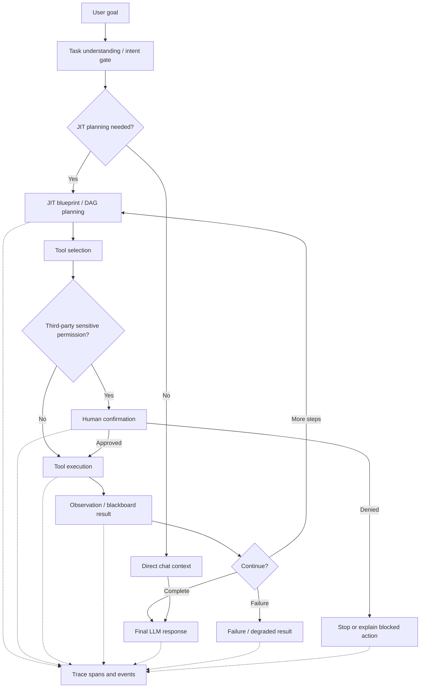
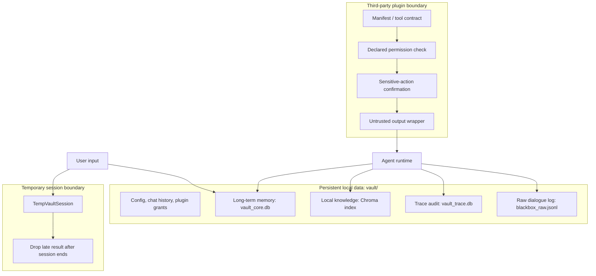

# Architecture

> 文档定位：本文描述 Vault OS 当前可从代码确认的本地优先 AI Agent 工作台架构，并将未验证、未完成或仅处于规划阶段的能力明确标为 TODO。产品定位见 [PRODUCT.md](PRODUCT.md)，产品案例见 [PRODUCT_CASE.md](PRODUCT_CASE.md)，开发与运行方式见 [DEVELOPER_GUIDE.md](DEVELOPER_GUIDE.md)。

## 1. Architecture Goals

Vault OS 的目标不是把聊天窗口叠加更多功能，而是把用户输入、长期记忆、本地知识、工具执行和可观察性收敛为一个本地工作台。当前架构围绕以下目标组织：

- **Local-first**：配置、聊天历史、记忆、向量索引、Trace 和插件运行数据围绕本地 `vault/` 保存；模型推理和 Embedding 仍可通过用户配置的兼容 API 调用外部服务。
- **Long-term memory**：把可沉淀的信息经过缓冲、路由、冲突检查和待审流程写入实体、关系与画像快照，避免把一次性对话当作长期事实。
- **Controllable Agent execution**：请求先经过意图门控；需要工具时生成并执行受依赖约束的 JIT/DAG 蓝图，无法规划时可降级为直接对话或本地兜底。
- **Traceable tool use**：主会话把任务、span、状态、耗时、错误和降级结果写入 Trace 存储，并实时推送给桌面 UI。
- **Plugin permission and safety boundary**：第三方插件按目录身份和声明权限处理；敏感调用需要确认，输出被包装为不可信数据。
- **Evaluation-driven iteration**：仓库已有测试与 Eval 测试矩阵；真实评测数据、指标趋势和反馈闭环仍是 TODO。

## 2. Product Architecture Overview



- **Desktop App / Command Console**：Vue 3 UI 承载工作台、会话、Trace 面板、记忆与插件入口；Tauri 壳负责生产环境 sidecar 生命周期和本地连接信息读取。路径：`chat-ui/src/App.vue`、`chat-ui/src/views/`、`chat-ui/src/composables/useNeuroLink.js`、`chat-ui/src-tauri/src/main.rs`。
- **Intent Router / JIT Gate**：根据交互意图决定跳过 JIT、生成工具蓝图或使用本地兜底。路径：`memory_rules.py`、`main.py`。
- **Context Orchestrator**：合并 L2 记忆预读、JIT/DAG 黑板结果与最终提示词；知识检索目前由工具计划触发，并非每个请求自动检索。路径：`main.py`、`rag_assembler.py`。
- **Memory**：管理实体、关系、事件、待审项和 L2 快照。路径：`memory_system.py`、`habit_extractor.py`。
- **RAG / Local Knowledge**：通过 Chroma 持久化索引本地知识切片，提供写入、按来源删除和搜索。路径：`chroma_engine.py`、`server.py`、`tool_executor.py`。
- **Agent Runtime / Tool Use**：WebSocket 请求进入线程池，主运行时可执行 JIT/DAG 工具步骤并生成最终回复。路径：`agent_runner.py`、`main.py`、`tool_registry.py`、`tool_executor.py`。
- **Plugin Permission**：对第三方插件执行权限、敏感参数、确认授权和不可信输出执行边界控制。路径：`plugin_security.py`、`server.py`、`chat-ui/src/utils/vpmLoader.js`。
- **Trace / Storage**：Trace 事件写入 SQLite 并通过事件总线回传 UI；运行数据位于 `vault/`。路径：`trace_system.py`、`core_bus.py`、`db.py`。
- **LLM Provider**：使用可配置的 OpenAI 兼容客户端；聊天与 Embedding 配置分离。路径：`main.py`、`chroma_engine.py`。
- **Eval**：单元测试与评测场景矩阵存在，但未见已归档的真实评测结果。路径：`tests/`、`docs/EVAL_REPORT.md`。

## 3. Core Request Flow



主会话由 `agent_runner.py` 在独立线程池中执行，前端等待上限为 60 秒。`trace_system.py` 会将主会话的执行状态与后台记忆流程关联到同一 Trace。临时会话走 `TempVaultSession`，刻意不绑定主记忆和 Trace；其晚到结果会按会话是否仍开启而丢弃。

## 4. Agent Execution & Trace Flow



当前 Trace 记录根任务、DAG 步骤、记忆流程、LLM 最终生成、状态、耗时和错误，并带有 watchdog 超时处理。代码路径：`main.py`、`agent_runner.py`、`trace_system.py`。权限预检面向第三方插件的敏感权限；并非所有工具调用都会出现确认对话框。

TODO：Trace 尚未实现完整的阶段摘要、失败解释、恢复建议或可归档的任务复盘视图。

## 5. Memory & Context Architecture

长期记忆由 `MemoryRepository` 和 `MemoryGatekeeper` 管理，持久化在 `vault/vault_core.db`。数据模型包括实体、关系、记忆事件、审查记录、待审事件以及 L2 实体/认知快照（`memory_system.py`）。请求进入主会话时，系统根据用户输入读取相关 L2 上下文，而非把整份记忆无差别拼入提示词。

写入路径以减少记忆污染为目标：输入先经过瞬时交互识别与缓冲；候选事件再经路由、重复/冲突判断后进入合并或待审状态。画像导入也采用“准备预览 → 提交记忆流程”的两阶段语义，路径见 `main.py` 与 `chat-ui/src/views/ProfileImportView.vue`。

临时会话由 `TempVaultSession` 提供独立运行时。它不会读取主记忆，也不会向主聊天历史或持久记忆写入；结束后会拦截迟到结果。路径：`main.py`、`server.py`、`agent_runner.py`。

TODO：尚未确认跨版本记忆迁移、保留期限、导出/恢复流程或面向用户的完整记忆来源解释机制。

## 6. RAG / Local Knowledge Architecture

当前可确认的本地知识链路如下：

```text
Data source → ingest payload / chunks → embedding → Chroma persistent index
→ registered local-knowledge search tool → context / DAG blackboard
→ final answer
```

- **已实现**：`VaultVectorDB` 使用 Chroma `PersistentClient` 保存索引，并提供 `add_chunks`、`delete_by_source` 与 `search`。路径：`chroma_engine.py`。
- **已实现**：`VaultOS_Terminal.receive_knowledge_payload()` 接收 `RAG_UPSERT` 载荷，按来源替换切片。路径：`main.py`。
- **已实现**：`/api/rag/ingest` 对外来 HTTP 摄入限制在插件目录；工具执行器可调用 `search_local_knowledge`。路径：`server.py`、`tool_executor.py`。
- **已实现**：最终提示词组装器可以接收检索/黑板上下文。路径：`rag_assembler.py`、`main.py`。
- **TODO**：未确认统一的文件解析器、通用自动切片入口、知识来源引用展示、检索命中反馈、冲突资料处理或回答级 citation 输出。不要将这些描述为现有能力。
- **TODO**：`docs/EVAL_REPORT.md` 定义了 RAG 质量场景，但未包含实际执行数据，无法据此声明召回率或答案质量指标。

## 7. Tool Use & Plugin Permission

工具由 `ToolRegistry` 从公共工具目录与插件目录读取 JSON 契约；`ToolExecutor` 负责内置和契约驱动的调用。JIT 蓝图中的步骤可通过依赖关系并行调度，并将结果写入黑板供最终回复使用。路径：`tool_registry.py`、`tool_executor.py`、`main.py`。

插件安全边界由 `PluginSecurityManager` 实施：

- 插件目录名是身份来源，第一方身份只对代码白名单 `music_agent` 生效，不能由 manifest 自行声明。
- 第三方工具需要声明所需权限；未声明的敏感权限会被阻断。
- 对敏感或高风险权限，系统经事件总线请求用户确认，并向 UI 提供脱敏参数预览。
- 第三方插件输出会封装为 `UNTRUSTED_PLUGIN_OUTPUT`，作为数据而不是系统指令处理。
- 授权拒绝、未声明权限和工具异常会作为执行结果/Trace 状态的一部分暴露给调用链。

路径：`plugin_security.py`、`tool_registry.py`、`tool_executor.py`、`server.py`、`tests/test_plugin_security.py`。

TODO：第三方插件后端 `api.py` 当前不会被自动挂载；其完整执行部署模型、插件可信来源体系、权限历史和数据删除语义仍需进一步定义。

## 8. Data & Safety Boundary



当前可确认的是本地存储、会话隔离、插件权限确认、参数脱敏和不可信插件输出包装；这不等同于完整安全体系。Trace 会对部分文本和 payload 做脱敏，但主运行时仍会把原始对话写入 `blackbox_raw.jsonl`（`main.py`），因此日志保留期限、访问控制和脱敏一致性是待解决的数据安全问题。

TODO：尚未确认本地数据加密、密钥保管、备份恢复、统一审计保留策略、插件卸载数据生命周期和完整威胁模型。

## 9. Evaluation Loop

评测应作为改进闭环，而不是宣传已完成的指标。仓库已有单元测试和场景矩阵，可用来定义后续评估输入：

| Evaluation area | Existing evidence | Next loop |
|---|---|---|
| RAG answer quality | `docs/EVAL_REPORT.md` 的 RAG 场景 | TODO：记录真实检索命中、引用和人工质量判断。 |
| Memory write accuracy | `tests/test_memory_buffer_pool.py`、`tests/test_memory_cognitive_snapshots.py` | TODO：统计待审接受、拒绝与修正结果。 |
| Tool execution success | `tests/test_execution_health_plan.py`、`tests/test_web_search_tool.py` | TODO：从 Trace 聚合成功、失败、超时和降级比例。 |
| Plugin safety | `tests/test_plugin_security.py` | TODO：建立权限请求、拒绝、阻断与异常的真实审计样本。 |
| Temporary-session isolation | `docs/EVAL_REPORT.md` 的 TEMP 场景 | TODO：将隔离场景作为自动化回归并保存执行结果。 |

目前不存在可据以宣称的完整 Eval 报告、基线数值或线上指标。`docs/EVAL_REPORT.md` 的“实际结果”栏仍应被视为待填写的测试设计。

## 10. Future Direction: A2A / Multi-Agent Collaboration

**TODO / Roadmap only：A2A 或多 Agent 协作不是当前主架构。** 当前代码可确认的是单个主 Agent 运行时、工具 DAG 与插件任务面板，不能将其描述为 Agent-to-Agent 协议。

如需扩展，应先明确并验证以下能力：

- Agent Card：能力、权限、数据边界与版本声明。
- Discovery：本地或受控目录中的 Agent 发现与可信来源校验。
- Task Delegation：可取消、可限时、可传递最小上下文的任务委派。
- Status / Result：统一的 `idle`、`running`、`success`、`failed`、`needs_permission` 状态模型。
- Trace：父子 Agent trace、工具调用和上下文来源关联。
- Human Approval：跨 Agent 的敏感权限、数据写入和高风险操作仍由用户确认。

在以上契约、权限模型、隔离策略和测试未落地前，A2A 只能作为 Future Direction。

## 11. Open Questions / TODO

- TODO：确认生产 Tauri 打包产物中 `vault_engine` sidecar 是否随构建提供，并以实际打包验证其启动链路。
- TODO：为 `blackbox_raw.jsonl` 定义脱敏、访问、保留和清理策略，并与 Trace 脱敏规则对齐。
- TODO：审查插件卸载路径与高风险变更预检是否一致，尤其是向量知识清理和插件目录删除的影响范围。
- TODO：补齐 RAG 的来源引用、检索反馈、摄入质量检查与可验证评测数据。
- TODO：补齐 Trace 的失败解释、恢复建议、摘要和归档复盘体验。
- TODO：补齐记忆来源解释、保留策略、导出/恢复和迁移边界。
- TODO：定义第三方插件后端加载、可信来源、权限历史与数据生命周期。
- TODO：在不改变当前临时会话隔离语义的前提下，决定是否需要临时会话 Trace，以及对应的数据保留范围。
