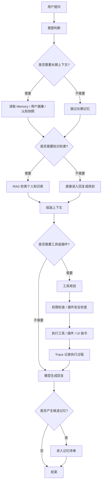

# Vault OS 产品案例复盘

> 文档定位：本文聚焦问题定义、产品方案、关键取舍和指标设计。项目入口页见 [../README.md](../README.md)，产品定义见 [PRODUCT.md](PRODUCT.md)，开发指南见 [DEVELOPER_GUIDE.md](DEVELOPER_GUIDE.md)。

## 概述

Vault OS 是一个面向 AI 重度用户、知识工作者和开发者的本地 AI Agent 工作台，尝试解决长期使用 AI 时反复出现的几个问题：上下文容易丢失、个人知识难以稳定接入、长期记忆不可控、工具执行过程不可见、插件扩展与权限安全边界不清晰。

产品方案不是再做一个普通聊天窗口，而是把 **Memory、RAG、Tool Use、Trace、Plugin Safety** 放进同一个本地工作台，让用户能够在可观察、可审核、可控制的环境里使用 AI 执行复杂任务。

## 1. 背景：为什么做 Vault OS

我在高频使用 AI 的过程中发现，真正影响 AI 工作效率的瓶颈并不只是模型能力，而是“长期协作基础设施”不足。

大多数 AI 产品在单次问答里已经足够好，但一旦用户进入持续几天、几周甚至几个月的真实工作流，就会出现明显断点：

- 每次重新打开对话，都需要重复交代项目背景、个人偏好、历史决策和上下文。
- 资料分散在本地文件、网页、笔记、历史聊天和代码仓库中，AI 很难稳定接入这些材料。
- “记忆”功能如果完全自动写入，用户会担心误记、脏数据、隐私泄露和不可撤销。
- Agent 调用工具时经常只给最终结果，用户看不到它为什么这么做、调用了什么、哪里失败了。
- 插件可以扩展能力，但如果缺少权限声明、敏感操作确认和输出隔离，很容易形成安全风险。

因此，Vault OS 的出发点是：**把 AI 从“会聊天的工具”推进到“可长期协作、可审计、可扩展的本地工作台”。**

这不是为了替代所有 SaaS AI 工具，而是优先服务一类用户：他们已经深度依赖 AI，希望把个人知识、长期记忆、工具调用和插件能力收束到一个自己可掌控的环境里。

## 2. 用户：AI 重度用户 / 知识工作者 / 开发者

### 2.1 AI 重度用户

这类用户每天大量使用 ChatGPT、Claude、Gemini、Cursor、Perplexity 等工具完成写作、研究、规划、复盘和执行。他们的问题不是“不会用 AI”，而是 AI 工具之间割裂严重，历史上下文难以沉淀。

典型需求：

- 希望 AI 记住长期偏好、项目背景、常用格式和过往决策。
- 希望临时探索不会污染长期记忆。
- 希望能查看 AI 执行任务的过程，而不是只看最终答案。

### 2.2 知识工作者

包括产品经理、研究员、咨询顾问、运营、内容创作者、设计师等。他们的核心工作依赖大量资料、会议记录、文档、笔记和历史判断。

典型需求：

- 把个人知识库接入 AI，而不是每次手动复制粘贴。
- 在回答中尽量复用已有材料，减少幻觉和重复劳动。
- 区分“事实资料”“个人偏好”“临时想法”和“待确认记忆”。

### 2.3 开发者

开发者不仅使用 AI 生成代码，也希望把 AI 接入本地工具链、脚本、插件和项目知识。

典型需求：

- 让 AI 能调用搜索、知识检索、本地工具或插件。
- 能看到工具调用链路、失败原因和中间状态。
- 插件扩展能力要有权限边界，避免第三方插件越权读写数据。

## 3. 痛点：上下文丢失、记忆不可控、工具不透明、插件不安全

### 3.1 上下文丢失：AI 难以持续理解用户

在真实工作流里，用户需要 AI 理解的不只是当前问题，还包括：项目背景、团队约束、历史讨论、个人偏好、之前做过的取舍和当前任务阶段。

如果这些信息无法被稳定保存和召回，用户每次都要重新解释，AI 也容易给出脱离上下文的建议。

产品影响：

- 任务启动成本高。
- 同类问题反复解释。
- AI 输出不稳定，难以形成长期协作关系。

### 3.2 个人知识难接入：资料在，但 AI 用不上

用户的资料通常已经存在，但分散在不同位置：本地文档、收藏内容、网页、笔记、聊天记录、代码仓库、插件数据等。

如果 AI 只能依赖当前输入，很容易出现两种情况：要么用户手动喂资料，效率低；要么 AI 基于通用知识回答，准确性不足。

产品影响：

- AI 很难贴合用户自己的资料和项目语境。
- 复杂任务需要大量手动上下文拼接。
- 回答缺少可追溯来源，用户需要二次核查。

### 3.3 长期记忆不可控：自动记忆会带来脏数据和隐私焦虑

长期记忆是 AI 工作台的关键能力，但不能简单理解为“自动记住一切”。

用户会在对话中说很多临时话、试探性想法、一次性任务、敏感信息和未确认事实。如果这些内容被系统自动写入长期记忆，就会产生三个问题：

- 误写：把临时需求当成长期偏好。
- 污染：旧信息、错误信息和噪声进入记忆系统。
- 不信任：用户不知道系统记住了什么，也不知道如何纠正。

因此，长期记忆必须是一个有边界、有审核、有来源的产品流程，而不是一个隐藏能力。

### 3.4 工具调用不透明：Agent 像黑盒

Agent 的价值在于能规划并调用工具，但如果用户看不到执行过程，就会产生新的不确定性。

常见问题包括：

- 用户不知道 AI 是否真的检索了知识库。
- 用户不知道工具调用是否失败、超时或降级。
- 用户无法判断最终答案来自记忆、RAG、工具结果还是模型推断。
- 当任务失败时，用户不知道应该补充信息、重试还是更换策略。

对复杂任务来说，“过程可见”本身就是产品体验的一部分。

### 3.5 插件不安全：扩展能力和权限边界天然冲突

插件机制可以让工作台接入更多场景，但插件越强，风险越高。

如果第三方插件可以读取数据、执行命令、打开 UI 或返回内容，而系统没有权限声明、敏感确认和输出隔离，那么插件就可能带来数据泄露、越权操作和提示注入风险。

因此，Vault OS 在插件设计上不只关注“能不能扩展”，也关注“扩展是否可控”。

## 4. 方案：Memory + RAG + Tool Use + Trace + Plugin Safety

Vault OS 的方案可以理解为一个本地 AI Agent 工作台的五层能力组合。

### 4.1 Memory：长期记忆与用户画像

Memory 层负责保存用户长期相关的信息，例如偏好、实体、关系、事件源、项目背景和认知快照。

关键设计点：

- 区分长期事实、临时请求和待确认内容。
- 将可能进入长期记忆的信息先进入待审流程，而不是直接永久写入。
- 通过实体、关系、事件源和快照组织记忆，避免只保存零散文本。
- 对搜索、播放、删除、推荐等瞬时交互进行过滤，降低误写率。

产品目标不是“让 AI 记得越多越好”，而是“让 AI 记得对、记得可控、记得有来源”。

### 4.2 RAG：个人知识检索

RAG 层负责把用户的知识资料转成可检索上下文，在回答前按需召回。

关键设计点：

- 使用向量库持久化知识材料。
- 将检索结果、用户画像、关系信息和认知快照组装进提示词。
- 让回答尽量基于用户已有资料，而不是完全依赖模型通用知识。
- 为后续“来源展示、检索反馈、资料管理”留下产品空间。

RAG 在这里不是孤立的知识库问答，而是和 Memory 一起构成用户的“个人上下文层”。

### 4.3 Tool Use：按意图触发的工具规划与执行

Tool Use 层负责让 AI 根据任务意图调用合适工具，而不是所有请求都进入复杂 Agent 流程。

关键设计点：

- 对简单闲聊、本地画像问答、临时请求等场景尽量绕过工具规划。
- 对需要外部信息、知识检索、插件能力或 UI 操作的任务生成执行蓝图。
- 将工具注册、工具描述和插件工具统一纳入可发现能力。
- 工具执行结果进入 Trace，便于用户查看和系统复盘。

这个设计避免把所有对话都做成“重型 Agent”，降低响应成本，也减少无意义工具调用。

### 4.4 Trace：执行过程可观测

Trace 层负责记录任务执行过程，包括 trace、span、状态、耗时、工具调用、异常和降级信息。

关键设计点：

- 复杂任务不能只展示最终回复，也要展示关键执行步骤。
- 用户可以看到 AI 当前处于规划、检索、调用工具、等待结果还是失败恢复阶段。
- 失败时保留上下文，便于判断是模型问题、工具问题、知识缺失还是权限问题。
- 为后续任务复盘、质量评估和指标统计提供数据基础。

Trace 的产品价值不是“展示技术日志”，而是把 Agent 黑盒变成用户能理解的执行过程。

### 4.5 Plugin Safety：插件权限、安全确认与输出隔离

Plugin Safety 层负责管理插件带来的扩展能力和风险。

关键设计点：

- 插件必须声明 manifest、工具契约、安全等级、权限和敏感原因。
- 第三方插件不能仅靠 manifest 自称 first-party 获得信任。
- 敏感权限需要用户确认。
- 第三方插件输出需要被视为不可信内容，不能直接作为系统指令执行。
- 插件 UI、工具调用和权限状态需要在工作台中有可见入口。

这个设计把插件从“随便接入工具”提升为“可管理的能力模块”。

## 5. 核心流程：用户提问 → 意图判断 → RAG/Memory → 工具规划 → 执行 → Trace → 回复

### 5.1 主流程

### 5.2 流程解释

1. **用户提问**：用户从主控终端或临时会话发起请求。
2. **意图判断**：系统判断这是闲聊、知识问答、长期协作、工具任务还是插件任务。
3. **RAG / Memory**：如果需要长期上下文，则读取用户画像、记忆、实体关系和认知快照；如果需要资料依据，则进行知识检索。
4. **工具规划**：如果任务需要搜索、知识库、插件或 UI 操作，则生成工具执行计划。
5. **执行**：工具执行过程中进行权限校验、插件安全检查、异常处理和结果回传。
6. **Trace**：记录执行步骤、状态、耗时、工具调用和失败信息，让用户能看到过程。
7. **回复**：模型基于当前问题、记忆、RAG 结果和工具结果生成回答。
8. **记忆待审**：如果对话中出现可能值得长期保存的信息，先进入待审，而不是直接写入长期记忆。

### 5.3 临时会话流程

临时会话是 Vault OS 中一个重要的边界设计。

临时会话适合：

- 随手问一个问题。
- 测试一个不确定想法。
- 讨论敏感或一次性内容。
- 不希望污染主记忆的探索。

临时会话的原则是：**不读取主记忆、不写入持久状态、结束后丢弃迟到结果。**

这让用户可以放心探索，而不担心系统把临时输入误当成长期事实。

## 6. 产品决策

### 6.1 为什么本地优先

Vault OS 选择 local-first，不是因为云端不重要，而是因为本项目要解决的问题天然涉及用户的长期数据资产：个人资料、历史对话、偏好、知识库、插件数据、Trace 记录和密钥配置。

如果这些数据完全托管在远端，用户会面临几个顾虑：

- 不知道哪些内容被保存、训练或共享。
- 私人资料和工作资料难以迁移。
- API Key、插件权限、工具调用日志等高敏感信息缺少可控边界。
- 一旦产品停服、限额变化或权限策略调整，个人 AI 工作流会受到影响。

本地优先带来的产品收益：

- 用户对数据位置、配置和运行态文件更可控。
- 更容易审计聊天历史、Trace、知识库、向量库和插件目录。
- 适合承载长期记忆、私有知识库和个人工作流。
- 为未来的备份、迁移、加密和权限管理打基础。

对应代价：

- 安装、配置和打包成本更高。
- 本地运行环境差异会带来更多兼容性问题。
- 对非技术用户的开箱体验不如 SaaS。

因此，当前阶段优先服务 AI 重度用户和开发者，而不是追求最低门槛的大众用户。

### 6.2 为什么设计临时会话

长期记忆系统最怕的问题之一是“什么都记”。

用户在 AI 对话中会进行大量探索：假设、吐槽、草稿、临时搜索、一次性请求、角色扮演、敏感信息和未确认判断。如果系统默认把这些内容都接入主记忆，会导致记忆污染。

临时会话的价值是给用户一个明确的心理模型：

- 主会话用于长期协作，可以使用记忆和知识。
- 临时会话用于一次性探索，不影响长期状态。

这类似浏览器的无痕窗口，但目标不是隐藏用户行为，而是保护长期记忆质量。

这个决策的核心取舍是：宁愿多给用户一个明确入口，也不要让用户猜测“这次对话会不会被记住”。

### 6.3 为什么记忆待审，而不是全自动写入

记忆功能看起来越自动，短期体验越顺滑，但长期风险越高。

Vault OS 没有把“自动记住一切”作为目标，而是采用记忆候选和待审机制。原因有三点：

第一，用户表达并不总是稳定事实。比如“我以后都想用英文回答”可能只是当前任务要求，不一定是长期偏好。

第二，模型抽取记忆会出错。它可能把语气、猜测、临时任务或错误信息提炼成长期结论。

第三，记忆是高信任能力。用户需要知道系统准备记住什么、为什么记住、来自哪里，以及是否可以拒绝。

因此，记忆待审的产品目标是降低“记忆误写率”，同时建立用户信任。

### 6.4 为什么保留 Trace，而不是只给最终答案

AI Agent 的复杂度越高，越不能只展示最终结果。

如果用户看不到过程，就无法判断：

- 是否真的检索了知识库。
- 是否调用了正确工具。
- 是否因为权限不足而跳过步骤。
- 是否发生失败、重试、降级或超时。
- 最终答案到底依据了什么。

Trace 的设计目标不是让普通用户读技术日志，而是把关键过程翻译成可理解的执行状态。

在 PM 视角里，Trace 同时承担三类价值：

- **用户体验价值**：降低等待焦虑，让用户知道 AI 在做什么。
- **质量管理价值**：定位任务失败原因，支持后续优化。
- **信任价值**：让工具调用、插件执行和记忆写入更透明。

### 6.5 为什么插件需要安全模型

插件是 Vault OS 的扩展核心，但插件也是风险入口。

如果插件可以接入 UI、工具、网络、本地文件或第三方服务，那么产品必须回答几个问题：

- 插件声明了哪些权限？
- 哪些权限需要用户确认？
- 插件返回的内容是否可信？
- 第三方插件能不能伪装成官方插件？
- 插件卸载、权限变更和敏感操作是否可审计？

Vault OS 的插件安全模型不是为了阻止扩展，而是为了让扩展能力可以长期存在。

没有权限边界的插件系统，早期看起来灵活，后期会变成不可信的黑盒。

## 7. 指标设计

Vault OS 当前更接近本地 AI 工作台原型，因此指标重点不是 DAU、留存或商业转化，而是围绕“AI 协作质量”和“用户可控性”设计。

### 7.1 任务成功率

**定义**：用户发起一个明确任务后，系统在无需大量人工补救的情况下完成目标的比例。

可拆分为：

- 简单问答成功率。
- 需要 RAG 的知识问答成功率。
- 需要工具调用的任务成功率。
- 需要插件能力的任务成功率。

评估方式：

- 人工标注任务是否完成。
- 对比用户是否追问“你没理解”“不是这个意思”“重新来”。
- 查看 Trace 中失败、超时、降级和重试比例。

为什么重要：

任务成功率直接反映 Agent 工作台是否真的减少了用户负担。

### 7.2 幻觉率

**定义**：在回答中出现无依据事实、错误引用、错误工具结果解释或与用户知识库冲突内容的比例。

可拆分为：

- 未检索却声称基于资料回答。
- RAG 结果存在但回答偏离资料。
- 工具调用失败后仍给出确定结论。
- 把用户画像或记忆错误用于当前任务。

降低方式：

- 强化 RAG 来源展示和检索反馈。
- 在工具失败时明确告知降级，而不是假装成功。
- 对高风险事实回答增加“不确定/需确认”表达。
- 将 Trace 与回答依据关联起来。

为什么重要：

知识工作者使用 AI 的关键不是答案看起来完整，而是答案是否可靠、可追溯、可修正。

### 7.3 记忆误写率

**定义**：系统生成的候选记忆中，被用户拒绝、修改或后续证明不应写入的比例。

可拆分为：

- 把临时请求误判为长期偏好。
- 把未确认信息写成事实。
- 把敏感信息放入不合适的记忆类型。
- 把旧信息与新信息合并错误。

降低方式：

- 增强瞬时交互识别规则。
- 将候选记忆进入待审，而不是自动写入。
- 展示记忆来源、抽取原因和影响范围。
- 对高不确定内容默认不写入或要求确认。

为什么重要：

长期记忆一旦失真，会反过来污染后续回答。记忆误写率是衡量长期协作质量的核心指标。

### 7.4 插件拦截率

**定义**：插件请求触发权限确认、敏感权限拦截、输出隔离或拒绝执行的比例。

注意：插件拦截率不是越高越好，也不是越低越好。它需要结合场景解释：

- 如果高风险插件几乎没有拦截，可能说明安全模型失效。
- 如果大量低风险操作被拦截，可能说明权限设计过度打扰用户。
- 合理目标是：高风险操作被稳定识别，低风险操作尽量少打断。

可观察维度：

- 敏感权限确认次数。
- 用户拒绝授权比例。
- 第三方插件输出被隔离次数。
- 插件执行失败中因权限导致的占比。

为什么重要：

插件安全指标可以帮助产品判断：当前安全模型是在保护用户，还是在制造摩擦。

### 7.5 补充指标

除四个主指标外，还可以观察：

- RAG 命中率：检索结果是否被回答实际使用。
- Trace 查看率：用户是否愿意展开执行过程。
- 临时会话占比：用户对隔离探索的需求强度。
- 记忆审核通过率：候选记忆质量是否稳定。
- 工具调用失败恢复率：失败后是否能给出可执行下一步。

## 8. 当前不足与下一步

### 8.1 当前不足

#### 1. 端到端体验仍偏开发者工具

Vault OS 当前更适合 AI 重度用户和开发者，对普通用户来说，安装、配置模型、理解本地运行态文件、管理插件权限仍有门槛。

下一步需要降低启动成本，包括更清晰的新手引导、默认配置检查、错误提示和一键诊断。

#### 2. Trace 仍是基础观测，不是完整复盘系统

当前 Trace 已经能展示执行步骤、状态和耗时，但还不够产品化。

用户真正需要的是：

- 这次任务分成了哪几个阶段？
- 哪一步失败了？
- 失败原因是什么？
- 我应该补充信息、重新授权、换工具，还是直接重试？

下一步可以把 Trace 从“执行日志”升级为“任务复盘面板”。

#### 3. 记忆审核体验还可以更强

待审机制解决了“不要自动误写”的问题，但审核本身也需要设计好，否则会变成新负担。

下一步需要补齐：

- 候选记忆来源。
- 抽取原因。
- 影响范围。
- 相似旧记忆提示。
- 接受、修改、合并、拒绝的操作路径。

#### 4. RAG 的可解释性不足

仅仅检索到资料还不够，用户需要知道回答基于哪些资料、资料是否过期、是否存在冲突，以及模型是否充分使用了检索结果。

下一步发展增强：

- 来源引用。
- 检索命中反馈。
- 资料冲突提示。
- 知识库摄入质量检查。

#### 5. 插件中心还需要可信体系

当前已有权限声明、敏感权限确认和第三方输出隔离的基础，但一个长期可用的插件生态还需要更完整的可信体系。

下一步发展考虑：

- 插件来源展示。
- 权限变更记录。
- 插件评分或风险标签。
- 卸载后的数据清理说明。
- 插件私有数据与共享数据的边界提示。

### 8.2 下一步 Roadmap

#### Now：稳定主控体验

- 固化主控终端、临时会话、Trace 基础面板和插件任务面板的交互骨架。
- 统一高风险操作文案，减少“看起来很酷但不够清楚”的表达。
- 补齐关键路径的异常提示和失败解释。

#### Next：提升长期记忆和可观测体验

- 记忆待审页支持来源、原因、影响范围和相似记忆对比。
- Trace 支持阶段摘要、失败解释和恢复建议。
- RAG 回答支持更明确的来源展示和检索反馈。
- 插件权限确认收敛为统一的高风险确认组件。

#### Later：构建可持续插件生态

- 插件中心增加可信体系、权限历史和数据边界说明。
- 支持更完整的备份、导出和迁移能力。
- 形成可演示的端到端案例：导入知识 → 提问 → 调用工具 → Trace 观测 → 记忆待审 → 插件安全确认。
